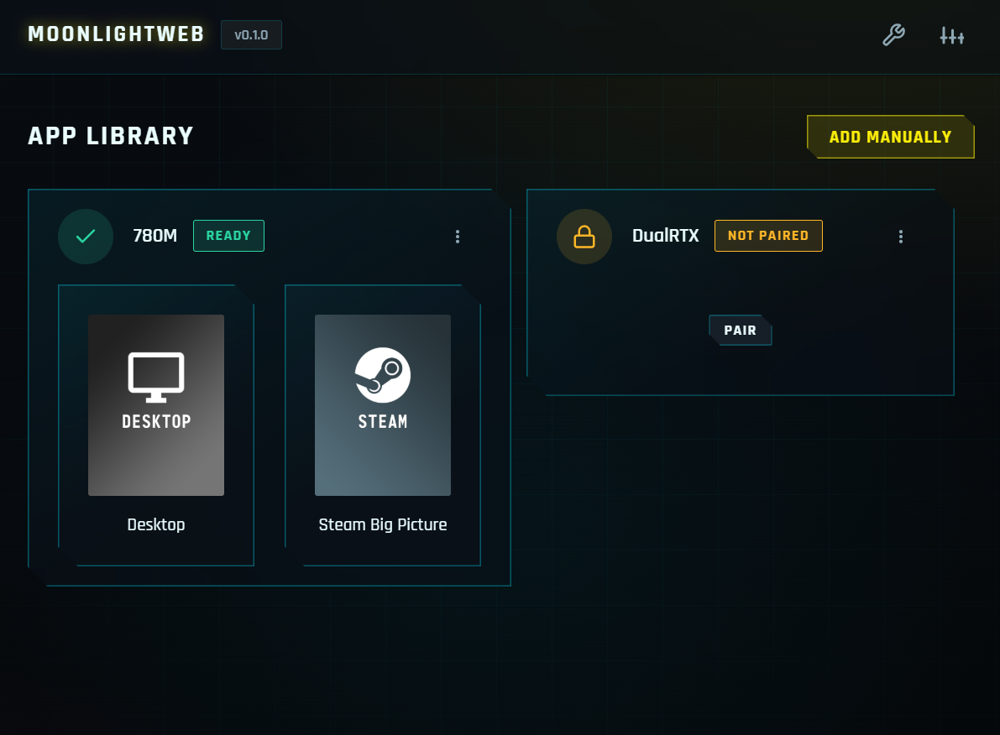
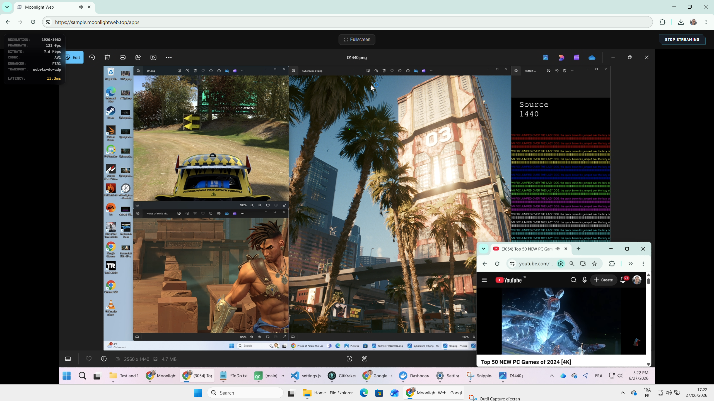
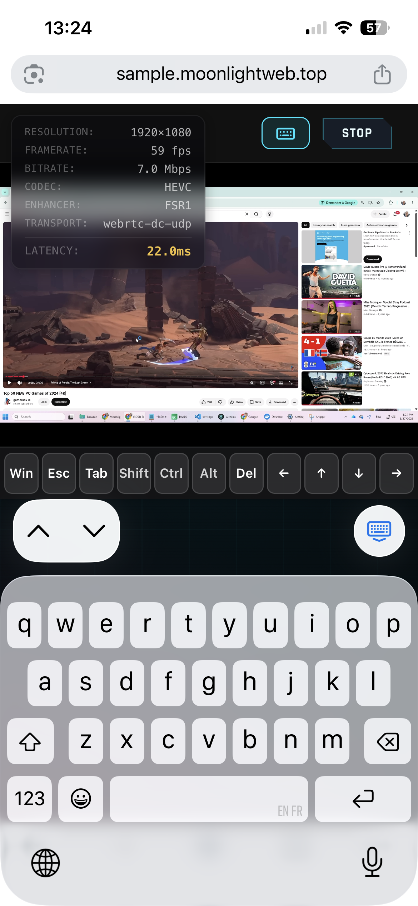
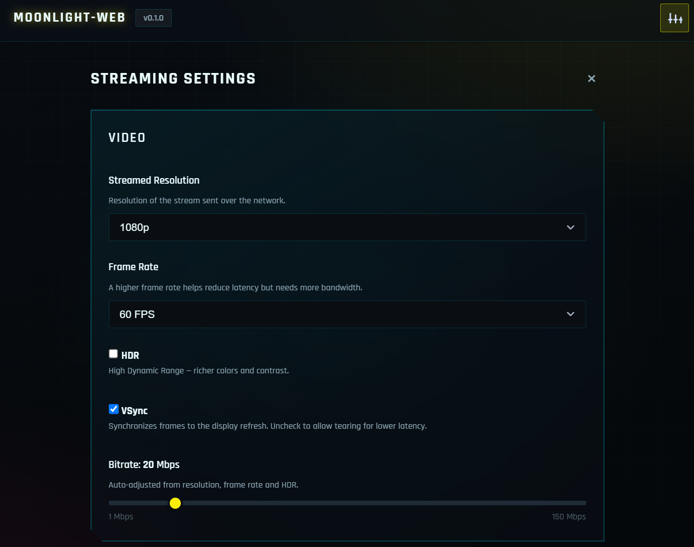
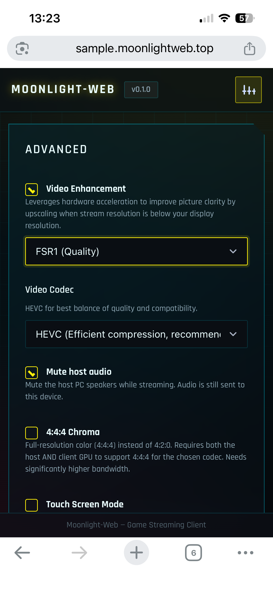
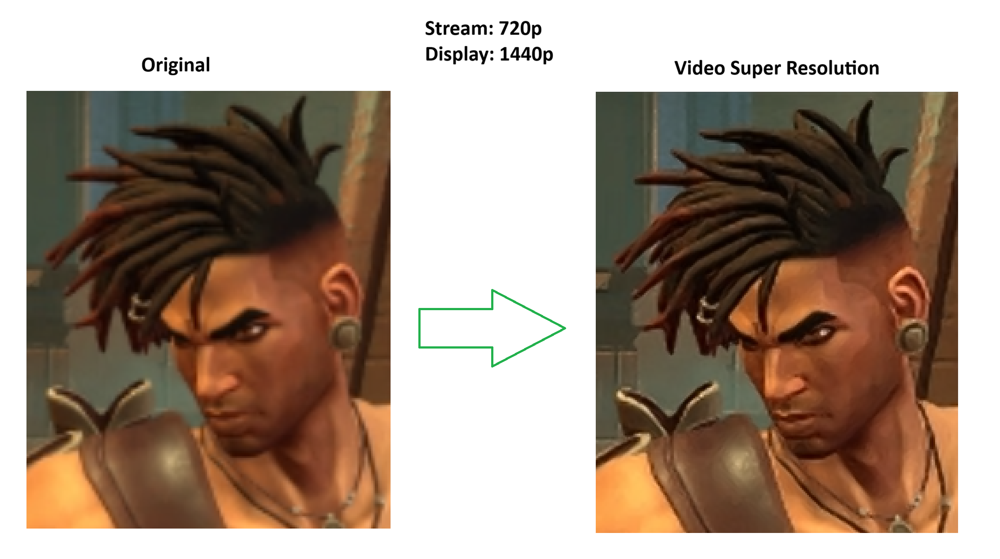
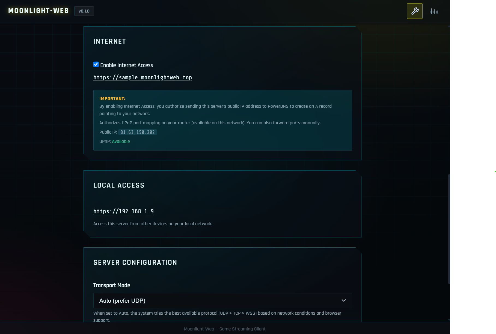

<div align="center">

# 🌙 Moonlight‑Web

**Stream your PC games from any browser.**\
A 100% web [Sunshine](https://github.com/LizardByte/Sunshine) / GameStream client\
Nothing to install on the client, just a URL.

[](LICENSE)


</div>

---

## ❤️ Support

If Moonlight-Web is useful to you, a coffee helps keep the shared DNS domain server online and the domain running 🙏

<div align="center">

<a href="https://buymeacoffee.com/brunoocto">
  
</a>

</div>

---

## ✨ What it does

Moonlight‑Web turns **any device with a modern browser** (PC, Mac, tablet, phone, TV) into a streaming client for your Sunshine‑powered gaming PC — **with nothing to install**.

- 🎮 **Low‑latency streaming** up to 4K HDR, 120+ FPS, **H.264 / HEVC / AV1** codecs.
- 🌐 **WebRTC transport** (DataChannels + RTP media tracks), automatic WSS fallback.
- 🔊 **Opus audio** decoded in the browser (adaptive jitter buffer, surround).
- ⌨️🖱️🎮 **Full input**: keyboard, mouse (pointer‑lock), touch trackpad, **Xbox/PS gamepads** with rumble.
- 🔎 **Auto‑discovery** of Sunshine hosts on the LAN (mDNS) + manual IP add.
- 🔐 Secure **pairing**, multi‑host, persistent sessions.
- 🌍 **Internet access** in one click: auto sub‑domain + TLS certificate.
- 🪄 **Video Enhancement** (bonus): GPU upscaling & sharpening in the browser.

<div align="center">



| 🖥️ Desktop | 📱 Mobile |
|:---:|:---:|
|  |  |

</div>

---

## 🚀 How it works

1. **Run the server** on any machine on the same LAN as Sunshine (the Sunshine PC itself is ideal, but not required).
2. **Open a browser** at `https://localhost` (or the PC's LAN IP, or your domain if Internet access is on).
3. The server **discovers your Sunshine hosts** (mDNS) — or add an IP manually.
4. **Pair** the host (PIN), pick an app, **stream**.

The C++/Qt backend embeds `moonlight-common-c`: it speaks GameStream (RTSP/RTP/ENet) to Sunshine and relays video/audio/input to the browser over WebRTC, with a WSS fallback.\
Video decodes in **WebCodecs + WebGPU/canvas**, audio in **AudioWorklet**.

### ⚙️ Stream settings

From the in‑app overlay: **bitrate** (1–150 Mbps or auto), **resolution** (720p–2160p),\
**FPS** (15–240), **codec** (auto / H.264 / HEVC / AV1, unsupported options greyed out),\
**HDR**, **4:4:4 chroma**, **Immersive mode** (pointer‑lock), perf stats and aspect ratio.

<div align="center">

| Video settings | Advanced options |
|:---:|:---:|
|  |  |

</div>

### 🪄 Video Enhancement (bonus)

Browser‑side image enhancement on the GPU (WebGPU): **upscaling (FSR1 & SGSRv1)** + **sharpening**, to gain sharpness when the stream resolution differs from the display resolution.

<div align="center">



</div>

---

## 📦 Install

> ✅ Moonlight‑Web runs on **any machine on the same LAN as Sunshine** — it doesn't have
> to be the Sunshine PC. **Installing it on the Sunshine machine is ideal** (minimal latency
> via localhost, instant mDNS discovery, simpler port forwarding), but not required.

1. **Prerequisite**: a PC with **Sunshine** installed and working.
2. **Grab** the latest release binary, **or** build from source (see [Fork & build](#-fork--build)).
3. **Run** `mw-server` (Windows: `mw-server.exe`). A **tray icon** appears.
4. Open **`https://localhost`** in a recent Chrome / Edge / Safari.
   - Default ports: **HTTP :80** (redirected) and **HTTPS :443**.
   - First launch uses a **self‑signed** cert — accept the browser warning (normal on LAN).
5. **Pair** your host and stream. From another LAN device: `https://<PC-LAN-IP>`.

---

## 🛠️ Admin page

The **Admin** page configures the server itself and is reachable **only from the local machine** (`https://localhost/admin`, or tray icon → *Server Settings*).\
All `/api/admin/*` routes return **403** for non‑localhost requests.

It controls: admin **PIN**, active **sessions**, HTTP/HTTPS **ports**, **transport** (WebRTC/WSS), **Internet access**, and the **certificate token**.

### 🌍 Internet access

Enabling **Internet Access** makes the server automatically:

1. **Detect your public IP** (STUN, HTTPS fallback).
2. **Create a sub‑domain** `「id」.yourdomain` via the PowerDNS API (A record + TXT ownership token).
3. **Obtain a TLS certificate** automatically (ACME DNS‑01).
4. **Open ports** via **UPnP** (TCP 80/443 + UDP 47999).

<div align="center">



</div>

**Possible limitations:** UPnP disabled (forward TCP 80/443 + UDP 47999 manually), CGNAT/double‑NAT (detected and reported — port forwarding won't work), port already mapped, or restrictive corporate networks (see [SSL](#-ssl--your-own-domain--certificate)).

---

## 🏗️ Architecture

```
   BROWSER (any device)                  Moonlight-Web SERVER (C++/Qt)            Sunshine HOST
 ┌───────────────────────────┐      ┌──────────────────────────────┐      ┌──────────────────┐
 │  Web App (Vanilla JS)     │ REST │  HTTP :80 → HTTPS :443       │HTTPS │  GameStream API  │
 │  Hosts / apps / pairing   │◄────►│  Static files + REST API     │◄────►│  /serverinfo     │
 │  Video : WebCodecs+WebGPU │      │  Proxy to Sunshine           │      │  /applist/launch │
 │  Audio : Opus/AudioWorklet│WebRTC│  ┌────────────────────────┐  │ RTSP │  /pair           │
 │  Input : kbd/mouse/gamepad│◄════►│  │  moonlight-common-c    │  │ RTP  │  GPU encoder     │
 │  Video Enhancement (GPU)  │ (WSS │  │  RTSP/RTP/ENet → Relay │  │◄════►│  (NVENC/AMF/QSV) │
 └───────────────────────────┘ fall)└──────────────────────────────┘ UDP  └──────────────────┘
        ▲ DNS (sub-domain) + TLS
 ┌──────┴────────────────────────────────────────────┐
 │  Self-hosted DNS stack (Docker, separate machine) │  ← maintained by the author,
 │  dnsdist :53 · PowerDNS (API) · Caddy :80/:443    │    or host your own
 └───────────────────────────────────────────────────┘
```

The server is a **web server** (frontend + REST API), a **proxy** to Sunshine's API, and a **streaming bridge** embedding `moonlight-common-c`. Video (H.264/HEVC/AV1) and Opus audio are relayed over **WebRTC** (DataChannels + RTP tracks), with **WSS** fallback.\
Input is encrypted (AES‑128‑GCM) and sent to Sunshine over the **ENet** control channel. The **DNS stack is decoupled** and can run on a dedicated machine — that's the server your donations help keep alive, but you can host your own (see [Fork & build](#-fork--build)).

---

## 🔧 Advanced config — `settings.json`

Most settings live in the UI and are stored **server‑side** in `settings.json`:

| OS | Path |
|---|---|
| **Windows** | `%APPDATA%\Moonlight-Web\Moonlight-Web\settings.json` |
| **macOS** | `~/Library/Application Support/Moonlight-Web/Moonlight-Web/settings.json` |
| **Linux** | `~/.local/share/Moonlight-Web/Moonlight-Web/settings.json` |

Notable keys not exposed in the UI: `domain` (custom FQDN), `cert_pem` / `cert_key` (your own cert, path or env‑var name), `audio_time_stretch`, `http_port` / `https_port`, `stun_server`.\
Restart the server after a manual edit.

### 🔐 SSL — your own domain & certificate

By default Moonlight‑Web obtains a free cert automatically via **ZeroSSL** (or Let's Encrypt), with auto‑renewal. Some restrictive corporate networks distrust certain CAs — in that case, use your own domain and certificate in `settings.json`:

```json
{
  "domain":   "stream.mydomain.com",
  "cert_pem": "C:/path/to/fullchain.pem",
  "cert_key": "C:/path/to/privkey.pem"
}
```

The cert's **CN must match** `domain`. A cert managed this way is **not** auto‑renewed — its lifecycle is yours.\
Point your DNS (`A`/`CNAME`) to your IP.

---

## 🍴 Fork & build

**Requirements:** Qt 6.11 (Core, Network, WebSockets; MSVC 2022 64‑bit kit on Windows) and OpenSSL 3.x (bundled in `backend/libs/windows/`).

```bash
git clone <this-repo>
cd moonlight-web-deepseek
git submodule update --init --recursive   # moonlight-common-c, qmdnsengine, libdatachannel...

# Windows (MSVC):
cmd //c backend/build_msvc.bat
# Linux / macOS (CMake):
cmake -S backend -B backend/build -DCMAKE_BUILD_TYPE=Release && cmake --build backend/build -j

cd backend/build/release && ./mw-server   # Windows: mw-server.exe → open https://localhost
```

Cross‑platform (Windows x64/ARM64, Linux, macOS) via CMake; the qmake `.pro` stays valid for Qt Creator.

**DNS stack (Internet access).** To offer auto sub‑domain + TLS you need an authoritative DNS server on a domain you own. [`deploy/powerdns/`](deploy/powerdns/) ships a turnkey Docker stack (dnsdist + PowerDNS + Caddy).\
Install on a small Linux VM with `sudo ./install.sh`, open ports 53 (UDP/TCP), 80 and 443, register your nameservers at your registrar, then set `MW_DOMAIN` / `MW_PDNS_URL` / `MW_PDNS_TOKEN` in the server's `.env`. See [`deploy/powerdns/README.md`](deploy/powerdns/README.md).

---

## 👤 About the author

I'm an experienced web developer with **15+ years** in the industry, and a long‑time contributor to the **Moonlight** ecosystem: I built and upstreamed **Video Super Resolution** (real‑time GPU upscaling) across *every* major Moonlight client. Moonlight‑Web is the natural next step — that same low‑latency,
high‑quality streaming on *any* device with a browser, no native app, just a URL.

| Platform | Contribution |
|---|---|
| 🪟🐧🍎 **Windows (x64 / ARM), Linux, macOS** | [moonlight‑qt #1557](https://github.com/moonlight-stream/moonlight-qt/pull/1557) |
| 🤖 **Android** | [moonlight‑android #1567](https://github.com/moonlight-stream/moonlight-android/pull/1567) |
| 🍏 **iOS & tvOS** | [moonlight‑ios #704](https://github.com/moonlight-stream/moonlight-ios/pull/704) |
| 🎮 **Xbox** | [moonlight‑xbox #267](https://github.com/TheElixZammuto/moonlight-xbox/pull/267) |

---

## 📜 License

GNU **GPL‑3.0**. Free to use, study, modify, fork and redistribute, provided it stays open‑source under the same license and **keeps the copyright notice and credits the original author**.

> Copyright © 2026 Bruno Martin &lt;brunoocto@gmail.com&gt;

See [LICENSE](LICENSE) and [COPYRIGHT](COPYRIGHT) for third‑party component licenses.

---

<div align="center">

**Like this project?** Leave a ⭐ and [buy the DNS server a coffee](#-support) ☕

</div>
