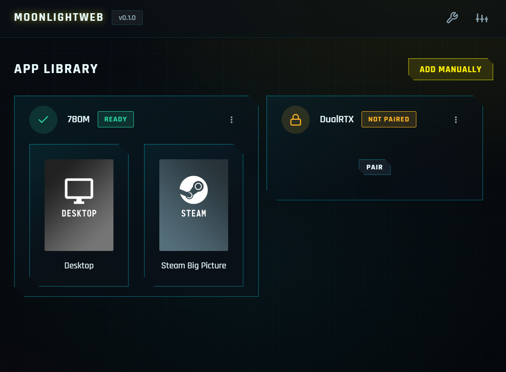
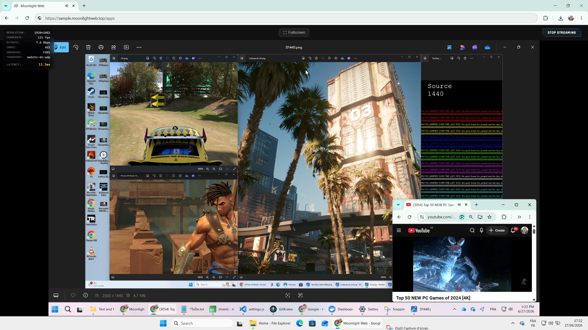
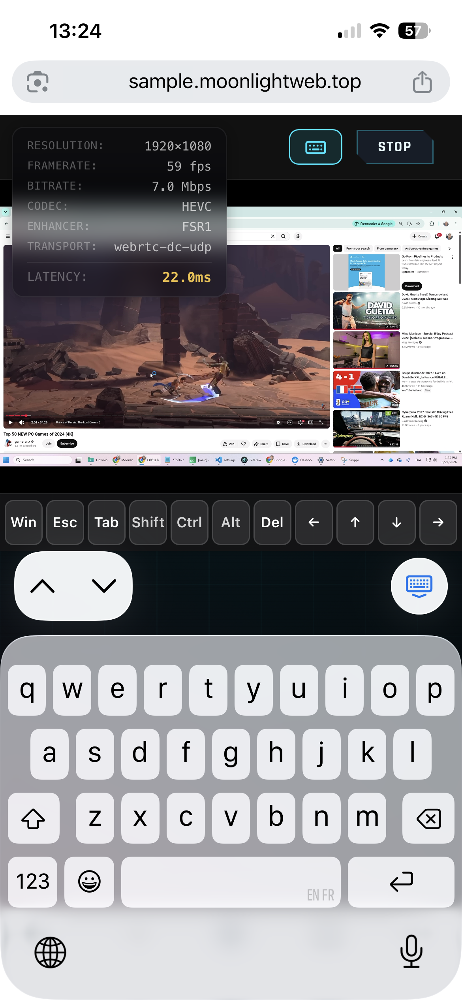
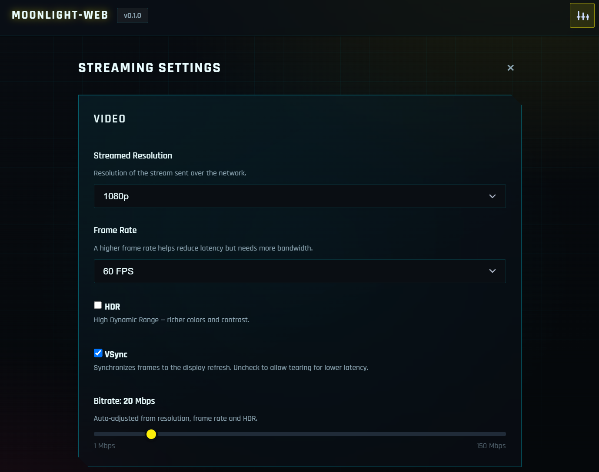
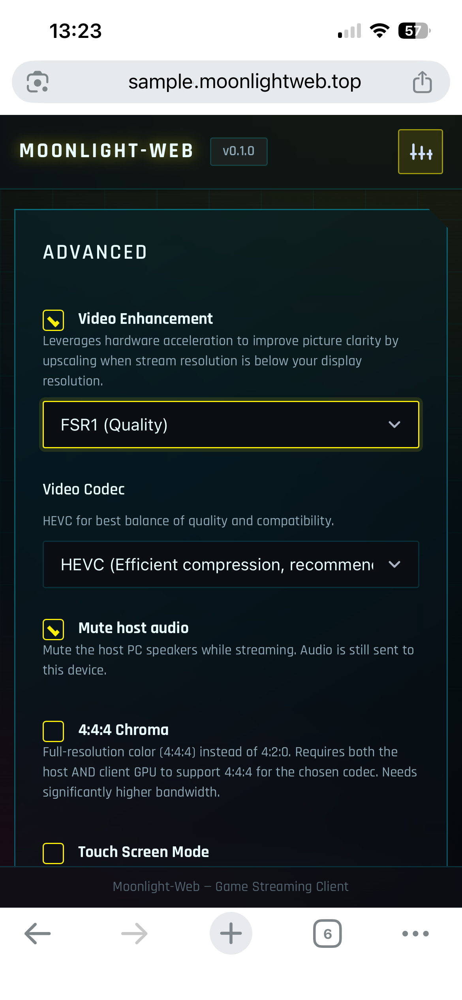
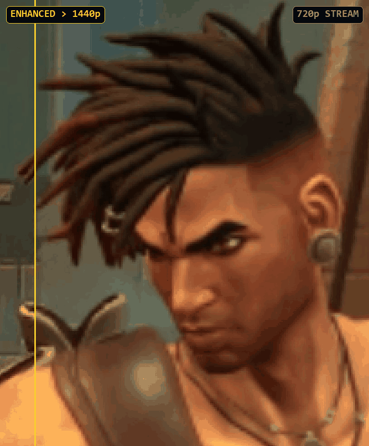
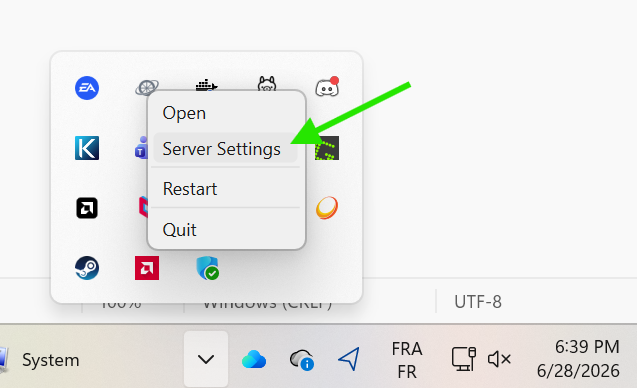
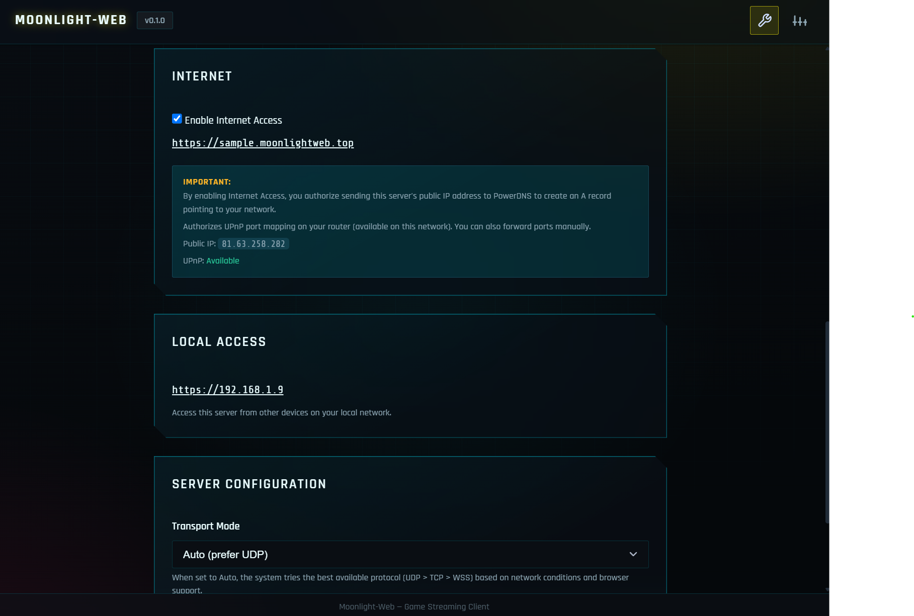

<div align="center">


# Moonlight‑Web

**Stream your PC games from any browser.**\
A 100% web [Sunshine](https://github.com/LizardByte/Sunshine) / GameStream client\
Nothing to install on the client, just a URL.

**🌐 Website: [moonlightweb.top](https://moonlightweb.top/)** — screenshots, [install guides](https://moonlightweb.top/guides/windows.html) & [FAQ](https://moonlightweb.top/faq.html)

[](LICENSE)


</div>

---

## Support

If MoonlightWeb is useful to you,\
a coffee helps keep the shared DNS domain server online and the domain running 🙏

<div align="center">

<a href="https://buymeacoffee.com/brunoocto">
  
</a>

</div>

---

## What it does

Moonlight‑Web turns **any device with a modern browser** (PC, Mac, tablet, phone, TV) into a streaming client for your Sunshine‑powered gaming PC — **with nothing to install**.

- 🎮 **Low‑latency streaming** up to 4K HDR, 240 FPS, **H.264 / HEVC / AV1** codecs.
- 🌐 **WebRTC transport** (DataChannels + RTP media tracks), automatic WSS fallback.
- 🔊 **Opus audio** decoded in the browser (adaptive jitter buffer, surround).
- ⌨️🖱️🎮 **Full input**: keyboard, mouse (pointer‑lock), touch trackpad, **Xbox/PS gamepads** with rumble.
- 🔎 **Auto‑discovery** of Sunshine hosts on the LAN (mDNS) + manual IP add.
- 🔐 Secure **pairing**, multi‑host, persistent sessions.
- 🌍 **Internet access** in one click: auto sub‑domain + TLS certificate.
- 🪄 **Video Enhancement** (bonus): GPU upscaling & sharpening in the browser.
- 👥 **Session sharing**: invite up to 3 people into your stream, as viewer, gamepad player, or full control.

<div align="center">



| 🖥️ Desktop | 📱 Mobile |
|:---:|:---:|
|  |  |

</div>

---

## How it works

1. **Run the server** on any machine on the same LAN as Sunshine (the Sunshine PC itself is ideal, but not required).
2. **Open a browser** at `https://localhost` (or the PC's LAN IP, or your domain if Internet access is on).
3. The server **discovers your Sunshine hosts** (mDNS) — or add an IP manually.
4. **Pair** the host (PIN), pick an app, **stream**.

The C++/Qt backend embeds `moonlight-common-c`: it speaks GameStream (RTSP/RTP/ENet) to Sunshine and relays video/audio/input to the browser over WebRTC, with a WSS fallback.\
Video decodes in **WebCodecs + WebGPU/canvas**, audio in **AudioWorklet**.

### Stream settings

From the in‑app overlay: **bitrate** (1–150 Mbps or auto), **resolution** (720p–2160p),\
**FPS** (15–240), **codec** (auto / H.264 / HEVC / AV1, unsupported options greyed out),\
**HDR**, **4:4:4 chroma**, **Immersive mode** (pointer‑lock), perf stats and aspect ratio.

<div align="center">

| Video settings | Advanced options |
|:---:|:---:|
|  |  |

</div>

---

## Session sharing

While you are streaming, the **Share** button (left of Stop) invites up to three
people into the same session. Each of them gets their own stream — their own
resolution, their own bitrate — on the app you already have running.

Pick a player row and you get **a link and a 6‑digit PIN**. Send them
separately: the link is expected to travel over chat and can leak, so on its own
it opens nothing. The PIN is what the guest is asked for the moment they open
the link, before they are even told which machine it is.

In the same popin you choose what they may do:

| Level | They can |
|---|---|
| **Viewer** (default) | watch and listen |
| **Gamer** | watch and play with a gamepad |
| **Full control** | watch, and use the keyboard and mouse of your PC |

The choice **freezes when you close the popin** — from that moment the link is
out in the world. To change it, turn the player off and share again, which mints
a new link and PIN and kills the old ones. Permissions are enforced in the
backend, not in the guest's page: a viewer's browser can send whatever it likes
and nothing reaches the host. Clipboard sync is off for guests entirely.

Reopening a live player row shows the same link and PIN again, so you can send
them to a second device without re‑sharing. They are held in memory only: a
restart forgets them while the invitation itself keeps working.

An invitation lasts **8 hours**. Nothing else ends it — a guest closing their
tab or a dropped connection leave it valid, and they can rejoin. It ends when
you click the player row, when you press Stop, or when the 8 hours are up. One
stream at a time per invitation: a second device on the same link is told the
seat is taken rather than stealing it.

**While a link is live, your own quality stops moving.** The automatic ladder
would relaunch your stream on the other slot to shave a few megabits, which on a
jittery network means transitioning more than streaming — and your guests ride
along. Sharing pins the profile; change it by hand in the settings if you need
to.

Pressing **Stop** with guests connected asks which one you mean: **Leave** takes
you out and lets the game — and your players — carry on, **Stop everything**
closes the app and disconnects everybody.

Each guest picks their own resolution when they join, plus how they want to
drive: immersive or not on a desktop, trackpad or direct touch on a phone. Their
browser remembers the choice for next time.

Ten wrong PINs destroy the invitation outright, so a leaked link can at worst
cost you a re‑share. Wrong PINs and dead links also feed the same per‑IP abuse
ban as the login page.

If a session is left running with no way to stop it — you closed the tab,
another device holds it — the host card's **⋯ → Stop session** ends the app for
everyone.

> Session sharing is a build‑time switch (`kSessionSharingEnabled` in
> `backend/src/server/ShareManager.h`). Turned off, every share route answers
> 404 and no entry point appears in the UI.

---

## Install

Grab the installer for your OS from the **[latest release](https://github.com/linckosz/moonlight-web/releases/latest)** — or from **[moonlightweb.top](https://moonlightweb.top/#download)**, which picks the right file for you. Step‑by‑step guides with screenshots: [Windows](https://moonlightweb.top/guides/windows.html) · [macOS](https://moonlightweb.top/guides/macos.html) · [Linux](https://moonlightweb.top/guides/linux.html).

> ✅ **Sunshine is handled for you.** The installers detect it, install it if missing and pair it
> automatically — you don't have to install it beforehand. (On Linux that step happens in the
> in‑app setup wizard rather than in the package; see below.)

> ℹ️ Moonlight‑Web runs on **any machine on the same LAN as Sunshine** — it doesn't have
> to be the Sunshine PC. **Installing it on the Sunshine machine is ideal** (minimal latency
> via localhost, instant mDNS discovery, simpler port forwarding, one‑click Sunshine setup),
> but not required — in that case just skip the Sunshine step and pair by IP.

### Windows 10 / 11

**`MoonlightWeb-installer-<version>-win-x64.exe`** (or `-win-arm64.exe` on ARM devices).

Double‑click it — the wizard (English / Français / 简体中文) does everything:

| Step | What it does |
|---|---|
| **Install** | App + Start‑Menu/Desktop shortcuts, firewall rule, optional **start at logon**. |
| **Internet link** | Opt‑in (unchecked by default): public sub‑domain + free TLS certificate. |
| **Sunshine** | Detected, or **installed silently** for you (official LizardByte installer), then **paired automatically** with the credentials you enter. |
| **Checklist** | Live progress (Sunshine → pairing → DNS record), then opens the admin page. |

**Updates** reuse the same installer: a single *Update* confirmation page, settings, Internet link and pairing kept. In‑app one‑click update works too (no UAC prompt — an elevated scheduled task is registered at install).\
**Service (optional):** `backend/packaging/windows/install-service.bat` installs a session‑0 service via NSSM (server available before any user logs in).

### macOS (Apple Silicon)

**`moonlightweb-<version>-macos-arm64.pkg`** — native installer: *Introduction → License → **Sunshine** → Install*. The Sunshine page detects or downloads and installs Sunshine for you; the app lands in `/Applications` with an optional **start at login** (LaunchAgent).

**Skip the Gatekeeper prompt.** The `.pkg` isn't notarized (an Apple Developer ID costs $99/yr, with no free or open‑source tier), so a *downloaded* one is refused with *"cannot be opened because it is from an unidentified developer"*. That check only applies to files a browser downloaded — either of these installs the exact same package without it:

```sh
brew install --cask linckosz/tap/moonlightweb
curl -fsSL https://moonlightweb.top/install.sh | bash
```

Both hand the `.pkg` to `installer(8)`, which never consults Gatekeeper. Keeping the downloaded file instead? On **macOS 15 Sequoia+**, double‑click it, let it be refused, then *System Settings → Privacy & Security → **Open Anyway*** (the old Control‑click → Open shortcut is gone) — or `xattr -dr com.apple.quarantine ~/Downloads/moonlightweb-*.pkg`.

⚠️ macOS cannot grant screen capture programmatically: allow **Sunshine** in *System Settings → Privacy & Security → Screen Recording* at its first launch. The in‑app wizard (`https://localhost/setup`) opens that pane for you and finishes anything the installer couldn't.\
*Intel Macs:* no prebuilt package — [build from source](#fork--build).

### Linux (x64)

**Install from the repository — one command, and updates handled for you:**

```sh
curl -fsSL https://moonlightweb.top/install.sh | bash
```

It registers the signed **APT** or **DNF** repository and installs from it, so `apt`/`dnf` upgrade MoonlightWeb along with the rest of the system, and the app shows up in **GNOME Software**, **KDE Discover** and Ubuntu's **App Center**. Arch and derivatives get [`moonlightweb-bin`](https://aur.archlinux.org/packages/moonlightweb-bin) from the AUR; distros with neither fall back to the AppImage. The repository can also be added by hand — see the [Linux guide](https://moonlightweb.top/guides/linux.html#one-line-install).

Or pick the package for your distro family directly. All of them are **self‑contained** (Qt + OpenSSL bundled, **no dependencies**), install to `/opt/moonlightweb` with a `moonlightweb` command and a menu entry, open the firewall ports (80/tcp, 443/tcp, 47999/udp) best‑effort, and start the app right after install.

| Distro family | Package | Command |
|---|---|---|
| **Debian · Ubuntu · Mint · Pop!\_OS · elementary · Zorin · Kali** | **`.deb`** | `sudo apt install ./moonlightweb-<ver>-linux-x64.deb` |
| **Fedora · RHEL · CentOS Stream · Rocky · Alma · Nobara** | **`.rpm`** | `sudo dnf install ./moonlightweb-<ver>-linux-x64.rpm` |
| **openSUSE · SLE** | **`.rpm`** | `sudo zypper install --allow-unsigned-rpm ./moonlightweb-<ver>-linux-x64.rpm` |
| **Arch · Manjaro · EndeavourOS · SteamOS · Bazzite · anything else** | **`.AppImage`** | `chmod +x moonlightweb-<ver>-linux-x64.AppImage && ./moonlightweb-<ver>-linux-x64.AppImage` |

> 💡 **On Debian/Ubuntu, use the `.deb`, not the AppImage.** An AppImage is a plain file: it needs
> the executable bit (`chmod +x`) — without it, double‑clicking only opens GNOME's *“Search for
> software”* dialog — plus **FUSE 2**, which Ubuntu ≥ 22.04 no longer ships
> (`sudo apt install libfuse2t64`, or `libfuse2` before 24.04; alternatively run it with
> `--appimage-extract-and-run`). The `.deb` has none of these caveats.

**Sunshine on Linux** is *not* shipped in the package. On first launch the app opens
`https://localhost/setup`, which installs the official Sunshine package for you (apt / dnf /
zypper / pacman families, via a single polkit password prompt) and pairs it. On other distros,
install Sunshine yourself, then pair from the UI.

**Autostart** uses an XDG autostart entry; for a headless/server install use the systemd unit in
[`backend/packaging/systemd/`](backend/packaging/systemd/).

### Docker — servers, NAS boxes and mini PCs

Official **`linux/amd64` + `linux/arm64`** images, built on official Debian and published to
GHCR on every release. Ideal for a headless box (Raspberry Pi 4/5, N100 mini PC, NAS) that sits
on the same LAN as the gaming PC.

```sh
docker run -d --name moonlightweb \
  --network host \
  --cap-drop ALL --cap-add NET_BIND_SERVICE \
  -v mw-data:/data \
  --restart unless-stopped \
  ghcr.io/linckosz/moonlight-web:latest
```

```sh
docker exec moonlightweb moonlightweb --new-pin        # required — see below
docker exec -it moonlightweb moonlightweb --set-admin-password
docker exec moonlightweb moonlightweb --status         # URLs, PIN, internet state
```

Then open **`https://<server-ip>`** and accept the self‑signed certificate.
Compose files: [`docker/docker-compose.yml`](docker/docker-compose.yml) (host networking) and
[`docker/docker-compose.bridge.yml`](docker/docker-compose.bridge.yml) (published ports, with
caveats).

> ⚠️ **The PIN is not optional in a container.** A desktop install trusts a browser on
> `127.0.0.1` and opens the setup wizard by itself; a container never sees that loopback peer
> (behind a bridge every request comes from the Docker gateway, and a headless server has no
> local browser anyway). Without a PIN the page loads into an authentication wall, and without
> an admin password the admin page cannot be opened from anywhere.

| | |
|---|---|
| **Tags** | `latest` · `0.2.4` · `0.2` · `sha-<commit>`. Release tags only — no `edge`, no nightly, so `latest` can never be work in progress. |
| **Ports to open** | **443/tcp** (web UI + signalling) and **80/tcp** (redirect + ACME challenge). WebRTC media takes **48010‑48014/udp** when UPnP maps it, an ephemeral UDP port otherwise. Sunshine is reached *outbound* on 47989/47984/47990 tcp, 47998‑48000 udp, 48010 tcp/udp. |
| **Volume** | `/data` — settings, TLS material, paired hosts and the **client identity**. Losing it un‑pairs every host. |
| **Env** | `MW_HTTPS_PORT` · `MW_HTTP_PORT` · `MW_UPNP` · `TZ` |
| **GPU** | **None required.** The server never decodes or re‑encodes: Sunshine encodes on its GPU, the browser decodes on the viewer's. No `/dev/dri`, no NVIDIA runtime, no VA‑API. Gamepad/keyboard/mouse arrive over the data channel — no `/dev/input`, no privileged container. |

> ⚠️ **Use `--network host`.** WebRTC binds an ephemeral UDP port (unpublishable), mDNS host
> discovery is multicast, and UPnP needs SSDP — all three stop at a bridge. The bridged compose
> file still works, but you add hosts by IP and the stream may fall back to its higher‑latency
> TCP transport.

**Sunshine cannot run in this image** — a container has no display to capture. Keep Sunshine on
the gaming PC and add it here by IP.

Full reference — every port, the volume layout, backups, non‑root operation, a systemd unit for
the Compose project, and troubleshooting: **[`docker/README.md`](docker/README.md)**.

### First launch (all platforms)

1. The server starts and shows a **tray icon**; a browser opens on the setup or admin page.
2. Open **`https://localhost`** in a recent Chrome / Edge / Safari.
   - Default ports: **HTTP :80** (redirected) and **HTTPS :443**.
   - Until the Internet link is enabled, the cert is **self‑signed** — accept the browser warning (normal on LAN).
3. **Pair** your host (PIN shown by Sunshine) and stream. From another LAN device: `https://<PC-LAN-IP>`; from anywhere: your sub‑domain, once [Internet access](#internet-access) is on.

Prefer to build it yourself? See [Fork & build](#fork--build).

---

## Video Enhancement (bonus)

Browser‑side image enhancement on the GPU (WebGPU): **upscaling (FSR1 & SGSRv1)** + **sharpening**, to gain sharpness when the stream resolution differs from the display resolution.

<div align="center">



</div>

---

## Admin page

The **Admin** page configures the server itself and is reachable **only from the local machine** (`https://localhost/admin`, or tray icon → *Server Settings*).\
All `/api/admin/*` routes return **403** for non‑localhost requests.

It controls: admin **PIN**, active **sessions**, HTTP/HTTPS **ports**, **transport** (WebRTC/WSS), **Internet access**, and the **certificate token**.

<div align="center">



</div>

### Internet access

Enabling **Internet Access** makes the server automatically:

1. **Detect your public IP** (STUN, HTTPS fallback).
2. **Create a sub‑domain** `「id」.moonlightweb.top` via the PowerDNS API (A record + TXT ownership token).
3. **Obtain a TLS certificate** automatically (ACME DNS‑01).
4. **Open ports** via **UPnP** (TCP 80/443 + UDP 47999).

<div align="center">



</div>

**Possible limitations:** UPnP disabled (forward TCP 80/443 + UDP 47999 manually), CGNAT/double‑NAT (detected and reported — port forwarding won't work), port already mapped, or restrictive corporate networks (see [SSL](#ssl--your-own-domain--certificate)).

---

## Architecture

```
   BROWSER (any device)                  MoonlightWeb SERVER (C++/Qt)            Sunshine HOST
 ┌───────────────────────────┐      ┌──────────────────────────────┐      ┌──────────────────┐
 │  Web App (Vanilla JS)     │ REST │  HTTP :80 → HTTPS :443       │HTTPS │  GameStream API  │
 │  Hosts / apps / pairing   │◄────►│  Static files + REST API     │◄────►│  /serverinfo     │
 │  Video : WebCodecs+WebGPU │      │  Proxy to Sunshine           │      │  /applist/launch │
 │  Audio : Opus/AudioWorklet│WebRTC│  ┌────────────────────────┐  │ RTSP │  /pair           │
 │  Input : kbd/mouse/gamepad│◄════►│  │  moonlight-common-c    │  │ RTP  │  GPU encoder     │
 │  Video Enhancement (GPU)  │ (WSS │  │  RTSP/RTP/ENet → Relay │  │◄════►│  (NVENC/AMF/QSV) │
 └───────────────────────────┘ fall)└──────────────────────────────┘ UDP  └──────────────────┘
        ▲ DNS (sub-domain) + TLS
 ┌──────┴────────────────────────────────────────────┐
 │  Self-hosted DNS stack (Docker, separate machine) │  ← maintained by the author,
 │  dnsdist :53 · PowerDNS (API) · Caddy :80/:443    │    or host your own
 └───────────────────────────────────────────────────┘
```

The server is a **web server** (frontend + REST API), a **proxy** to Sunshine's API, and a **streaming bridge** embedding `moonlight-common-c`. Video (H.264/HEVC/AV1) and Opus audio are relayed over **WebRTC** (DataChannels + RTP tracks), with **WSS** fallback.\
Input is encrypted (AES‑128‑GCM) and sent to Sunshine over the **ENet** control channel. The **DNS stack is decoupled** and can run on a dedicated machine — that's the server your tips help keep alive, but you can host your own (see [Fork & build](#fork--build)).

---

## Advanced config — `settings.json`

Most settings live in the UI and are stored **server‑side** in `settings.json`:

| OS | Path |
|---|---|
| **Windows** | `%APPDATA%\MoonlightWeb\MoonlightWeb\settings.json` |
| **macOS** | `~/Library/Application Support/MoonlightWeb/MoonlightWeb/settings.json` |
| **Linux** | `~/.local/share/MoonlightWeb/MoonlightWeb/settings.json` |

Notable keys not exposed in the UI: `domain` (custom FQDN), `cert_pem` / `cert_key` (your own cert, path or env‑var name), `audio_time_stretch`, `http_port` / `https_port`, `stun_server`.\
Restart the server after a manual edit.

### SSL — your own domain & certificate

By default Moonlight‑Web obtains a free cert automatically via **ZeroSSL** (or Let's Encrypt), with auto‑renewal. Some restrictive corporate networks distrust certain CAs — in that case, use your own domain and certificate in `settings.json`:

```json
{
  "domain":   "stream.mydomain.com",
  "cert_pem": "C:/path/to/fullchain.pem",
  "cert_key": "C:/path/to/privkey.pem"
}
```

The cert's **CN must match** `domain`. A cert managed this way is **not** auto‑renewed — its lifecycle is yours.\
Point your DNS (`A`/`CNAME`) to your IP.

---

## Fork & build

Cross‑platform build via **CMake** — the single, canonical build system (qmake removed).
CMake also generates `compile_commands.json` for clangd / IDEs.

```bash
git clone https://github.com/linckosz/moonlight-web.git
cd moonlight-web
git submodule update --init --recursive   # moonlight-common-c, qmdnsengine, libdatachannel...

# Windows (MSVC) — detects VS 2022 + Qt, configures Ninja, builds Release:
cmd //c backend/build_msvc.bat
# Linux / macOS — same, via CMake (Ninja if available):
./backend/build.sh
#   …or the raw CMake call the scripts wrap:
#   cmake -S backend -B build -DCMAKE_BUILD_TYPE=Release && cmake --build build -j

./build/MoonlightWeb   # Windows: build\MoonlightWeb.exe → open https://localhost
```

> Both scripts auto‑init the git submodules on first run and drop the binary in `build/`.
> If CMake can't find Qt, pass `-DCMAKE_PREFIX_PATH=<Qt kit>` (or set `QTDIR`), e.g. `C:/Qt/6.11.0/msvc2022_64`.

👉 **Full developer setup** — required tools (with links), Qt installer components,
**Qt Creator** kit configuration, frontend tests and the PR workflow — is in
**[CONTRIBUTING.md](CONTRIBUTING.md)**.

**DNS stack (Internet access).** To offer auto sub‑domain + TLS you need an authoritative DNS server on a domain you own. [`deploy/powerdns/`](deploy/powerdns/) ships a turnkey Docker stack (dnsdist + PowerDNS + Caddy).\
Install on a small Linux VM with `sudo ./install.sh`, open ports 53 (UDP/TCP), 80 and 443, register your nameservers at your registrar, then set `MW_DOMAIN` / `MW_PDNS_URL` / `MW_PDNS_TOKEN` in the server's `.env`. See [`deploy/powerdns/README.md`](deploy/powerdns/README.md).

---

## About the author

I'm an experienced web developer with **15+ years** in the industry, and a long‑time contributor to the **Moonlight** ecosystem: I built and upstreamed **Video Super Resolution** (real‑time GPU upscaling) across *every* major Moonlight client. Moonlight‑Web is the natural next step — that same low‑latency,
high‑quality streaming on *any* device with a browser, no native app, just a URL.

| Platform | Contribution |
|---|---|
| **Windows (x64 / ARM), Linux, macOS** | [moonlight‑qt #1557](https://github.com/moonlight-stream/moonlight-qt/pull/1557) |
| **Android** | [moonlight‑android #1567](https://github.com/moonlight-stream/moonlight-android/pull/1567) |
| **iOS & tvOS** | [moonlight‑ios #704](https://github.com/moonlight-stream/moonlight-ios/pull/704) |
| **Xbox** | [moonlight‑xbox #267](https://github.com/TheElixZammuto/moonlight-xbox/pull/267) |

---

## License

GNU **GPL‑3.0**. Free to use, study, modify, fork and redistribute, provided it stays open‑source under the same license and **keeps the copyright notice and credits the original author**.

> Copyright © 2026 Bruno Martin &lt;brunoocto@gmail.com&gt;

See [LICENSE](LICENSE) and [COPYRIGHT](COPYRIGHT) for third‑party component licenses.

---

<div align="center">

**Like this project?** Leave a ⭐ and [buy the DNS server a coffee](#support) ☕

</div>
