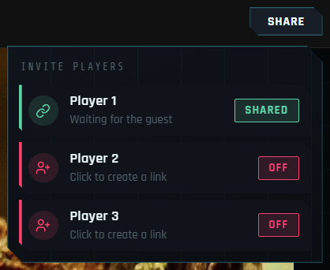
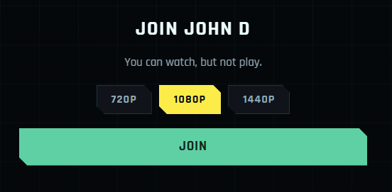
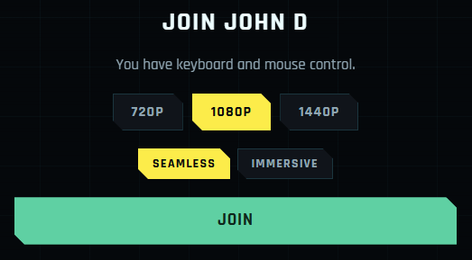

<div align="center">


# Moonlight‑Web

**Stream your PC games from any browser.**\
Install it on the gaming PC — it captures and encodes that machine **itself**, no second streaming server to set up.\
Nothing to install on the client either: just a URL, from your LAN or from anywhere.\
Under **20 ms** glass‑to‑glass over Wi‑Fi on a LAN, ~**25 ms** over the Internet.

**🌐 Website: [moonlightweb.top](https://moonlightweb.top/)** — screenshots, [install guides](https://moonlightweb.top/guides/windows.html) & [FAQ](https://moonlightweb.top/faq.html)\
**💬 Community: [Discord](https://discord.gg/wfbesPx4UB)** — questions, help and new‑release announcements

[](https://discord.gg/wfbesPx4UB)
[](LICENSE)


</div>

---

## What it does

Moonlight‑Web turns your gaming PC into a stream, and **any device with a modern browser** (PC, Mac, tablet, phone, TV) into the client. Only the server gets installed.

- 🖥️ **Its own capture & encode engine** — the machine it runs on is a host straight away: no Sunshine, no pairing, no PIN. One card per display. Windows, Linux and macOS.
- 🎮 **Low‑latency streaming** up to 4K HDR, 240 FPS, **H.264 / HEVC / AV1**, on **NVENC · AMF · Quick Sync · VA‑API · VideoToolbox** (software fallback).
- 🌐 **WebRTC transport** (DataChannels + RTP media tracks), automatic WSS fallback.
- 🔊 **Opus audio**, adaptive jitter buffer, surround.
- ⌨️🖱️🎮 **Full input**: keyboard, mouse (pointer‑lock), touch trackpad, **Xbox/PS gamepads** with rumble.
- 🤝 **Pairs with other hosts too** — Sunshine/Apollo, Wolf, MultiSeat: [see below](#other-hosts-it-can-pair-with). mDNS discovery, PIN pairing, multi‑host.
- 🌍 **Internet access** opt‑in, at a `stream.moonlightweb.top/「id」` address, with nothing published in your name.
- 🪄 **Video Enhancement** (bonus): GPU upscaling & sharpening in the browser.
- 👥 **Session sharing**: invite up to 3 people as viewer, gamepad player or full control.

<div align="center">


| 🖥️ Desktop | 📱 Mobile |
|:---:|:---:|
|  |  |

</div>

---

## How it works

1. **Install the server on the gaming PC.**
2. **Open a browser** at `https://localhost`, at the PC's LAN IP, or at your [entry link](#internet-access) from outside.
3. **The PC is already in the list** as `<hostname> — MoonlightWeb Host`, one card per display. Nothing to pair.
4. **Click a display and stream.** Other hosts on the LAN are discovered next to it and can be [paired too](#other-hosts-it-can-pair-with).

**The native engine** hands the captured GPU surface straight to the GPU encoder, in the process that holds the WebRTC connection: `capture → encode (zero‑copy) → SCTP/DTLS → browser`. No loopback hop, RTSP, RTP or FEC. On an RTX 5060 Ti at 1440p: **0.06 ms** to acquire a frame, **3.46 ms** to encode it, **one** memory copy.\
The browser decodes with **WebCodecs + WebGPU/canvas** and plays audio in an **AudioWorklet**.

> The engine also runs under the Windows service, in the logged‑on user's session. Where it cannot run (no usable encoder, Windows ARM64), the card is hidden and the app offers a host to pair with. A **headless** PC keeps its card through **"MoonlightWeb Virtual Display"**, a signed virtual monitor offered by the installer (a Mac creates its own). It turns on for a stream at 1080p 120 Hz, and your displays are restored when the stream ends.

### Stream settings

From the in‑app overlay: **bitrate** (1–150 Mbps or auto), **resolution** (720p–2160p),\
**FPS** (15–240), **codec** (auto / H.264 / HEVC / AV1, unsupported options greyed out),\
**HDR**, **4:4:4 chroma**, **Mouse Gaming Mode** (pointer‑lock), perf stats and aspect ratio.

<div align="center">

| Video settings | Advanced options |
|:---:|:---:|
|  |  |

</div>

### Controllers

Standard pads just work. Others are recognized from [SDL_GameControllerDB](https://github.com/mdqinc/SDL_GameControllerDB), and any pad can be remapped in **Settings → Controllers**. Tested on Windows + Chrome:

| Controller | Connection / mode | Result |
|---|---|---|
| Xbox One S Controller | Bluetooth | ✅ |
| Switch Pro Controller | USB‑C | ✅ |
| Switch Pro Controller | Bluetooth | ❌ not read correctly by browsers |
| GameSir X2 Lightning | — | ✅ |
| 8BitDo SN30 Pro | USB‑C (Xbox 360) | ✅ |
| 8BitDo SN30 Pro | Bluetooth, Start+X (Xbox One S) | ✅ |
| 8BitDo SN30 Pro | Bluetooth, Start+A (PS4) | ✅ |
| 8BitDo SN30 Pro | Bluetooth, Start+B (8BitDo) | ✅ |
| 8BitDo SN30 Pro | Bluetooth, Start+Y (Switch Pro) | ❌ not read correctly by browsers |

Details and test notes in the [wiki](docs/wiki/04-Frontend.md#48-controller-compatibility).

---

## Other hosts it can pair with

The native engine streams **the machine MoonlightWeb runs on**. Moonlight‑Web is also a full GameStream client: other hosts are paired and streamed through the embedded `moonlight-common-c`.

```
  MoonlightWeb server (C++/Qt)                   A paired host on your LAN
┌─────────────────────────────────┐  HTTPS   ┌──────────────────────────────┐
│  moonlight-common-c (embedded)  │◄────────►│  GameStream API              │
│  RTSP / RTP / ENet  →  relay    │   RTSP   │  /serverinfo /applist /pair  │
│  re-packetised onto WebRTC      │◄════════►│  GPU encoder                 │
└─────────────────────────────────┘  RTP/UDP └──────────────────────────────┘
```

| Host | What it is | How it pairs |
|---|---|---|
| **[Sunshine](https://github.com/LizardByte/Sunshine)** · **Apollo** | The reference GameStream host, and its fork | mDNS or by IP, with the PIN the host shows. |
| **[Wolf](https://games-on-whales.github.io/wolf/)** (Games‑on‑Whales) | Containerised host: profiles, Docker catalogue, lobbies and co‑op | Automatic: MoonlightWeb posts the PIN through Wolf's `/api/v1`. One certificate per device, so two players are two clients. |
| **MultiSeat** | One Windows box split into independent seats, each with its own Apollo | Seats are provisioned through MultiSeat's API, then each is paired on its own. |

Both integrations are documented in [`docs/integration-multiseat-wolf.md`](docs/integration-multiseat-wolf.md).

> ⚠️ MultiSeat's per‑seat stream path is **not yet tested end to end**: provisioning a seat needs a free Windows session the bench cannot offer.

Using MoonlightWeb only as a front end? Set `"native_host_enabled": false` in [`settings.json`](#advanced-config--settingsjson) to hide this machine's card.

---

## Session sharing

The **sharing board** invites up to three people into your session, each with their own stream, resolution and bitrate. Open it from the **Share** button of a running stream, or from a host's ⋯ menu before anything is streaming (the first guest's PIN then starts the app).



Each player row gives **a link and a 6‑digit PIN**. Send them separately: the link alone opens nothing.

| Level | They can |
|---|---|
| **Viewer** (default) | watch and listen |
| **Gamer** | watch and play with a gamepad |
| **Desktop** | watch, and use the keyboard and mouse of your PC |
| **Full** | all of it — gamepad, keyboard and mouse |

|  |  |
|---|---|
| A **Viewer** just watches and listens. | **Full control** hands over the keyboard and mouse. |

- **The level can change mid‑game**, and keys held by the guest are released. Permissions are enforced by the server, and clipboard sync is off for guests.
- **One invitation, one machine.** The first device to enter the PIN owns the link; any other attempt is refused and shown on the board.
- **Regenerate** issues a new link and PIN and disconnects the old one.
- **Lifetime:** 1 h, 4 h, 8 h, 24 h, 48 h or unlimited. A guest can rejoin until you close the row, press Stop, or time runs out.
- **Your quality stays fixed** while a link is live, so the auto ladder never restarts the stream under your guests.
- **Stop** asks: **Leave** (the game and players carry on) or **Stop everything**.
- **Ten wrong PINs** destroy the invitation, and failed attempts count towards the login ban.
- A session left running elsewhere can be ended from the host card's **⋯ → Stop session**.

> Session sharing is a build‑time switch (`kSessionSharingEnabled` in
> `backend/src/server/ShareManager.h`). Turned off, every share route answers
> 404 and no entry point appears in the UI.

---

## Install

Grab the installer from the **[latest release](https://github.com/linckosz/moonlight-web/releases/latest)** or **[moonlightweb.top](https://moonlightweb.top/#download)**, which picks the right file. Guides with screenshots: [Windows](https://moonlightweb.top/guides/windows.html) · [macOS](https://moonlightweb.top/guides/macos.html) · [Linux](https://moonlightweb.top/guides/linux.html).

> ✅ **Nothing else to install.** Install it **on the gaming PC** — that is the whole setup.

> ℹ️ It also runs on **another LAN machine** (NAS, mini PC, container) to stream the hosts you pair with, without the native engine.

### Windows 10 / 11

**`MoonlightWeb-installer-<version>-win-x64.exe`** (or `-win-arm64.exe` on ARM devices). The wizard (English / Français / 简体中文) does everything:

| Step | What it does |
|---|---|
| **Install** | App + Start‑Menu/Desktop shortcuts, firewall rule, optional **start at logon**. |
| **Gamepad driver** | ViGEmBus installed silently — what lets a browser's gamepad appear as a real controller on this PC. |
| **Internet link** | Opt‑in (unchecked by default): allows remote streaming sessions (per‑session router port via UPnP). |
| **Checklist** | Live progress, then opens the admin page. |

Sunshine is no longer installed (since September 2026); an existing Sunshine is discovered and paired like any other host.

**Updates:** rerun the installer or use the in‑app button (no UAC prompt); settings and pairings are kept.\
**Service (optional):** `backend/packaging/windows/install-service.bat` installs a session‑0 service via NSSM.

### macOS (Apple Silicon)

**`moonlightweb-<version>-macos-arm64.pkg`** — installs to `/Applications` with an optional **start at login**.

The `.pkg` is not notarized, so a downloaded copy is blocked by Gatekeeper. Either command installs it without the prompt:

```sh
brew install --cask linckosz/tap/moonlightweb
curl -fsSL https://moonlightweb.top/install.sh | bash
```

For a downloaded file on macOS 15+: *System Settings → Privacy & Security → **Open Anyway***, or `xattr -dr com.apple.quarantine ~/Downloads/moonlightweb-*.pkg`.

⚠️ Allow **MoonlightWeb** in *Privacy & Security → Screen Recording* at first launch; the setup page (`https://localhost/setup`) opens that pane for you.\
*Intel Macs:* no prebuilt package — [build from source](#fork--build).

### Linux (x64)

**One command, updates included:**

```sh
curl -fsSL https://moonlightweb.top/install.sh | bash
```

It adds the signed **APT** or **DNF** repository, so MoonlightWeb updates with the system and appears in GNOME Software, KDE Discover and App Center. Arch uses [`moonlightweb-bin`](https://aur.archlinux.org/packages/moonlightweb-bin) from the AUR. Manual setup: [Linux guide](https://moonlightweb.top/guides/linux.html#one-line-install).

Or install a package directly. All are **self‑contained** (Qt + OpenSSL bundled), install to `/opt/moonlightweb`, open the firewall ports (80/tcp, 443/tcp, 48550‑48573/udp) and start the app.

| Distro family | Package | Command |
|---|---|---|
| **Debian · Ubuntu · Mint · Pop!\_OS · elementary · Zorin · Kali** | **`.deb`** | `sudo apt install ./moonlightweb-<ver>-linux-x64.deb` |
| **Fedora · RHEL · CentOS Stream · Rocky · Alma · Nobara** | **`.rpm`** | `sudo dnf install ./moonlightweb-<ver>-linux-x64.rpm` |
| **openSUSE · SLE** | **`.rpm`** | `sudo zypper install --allow-unsigned-rpm ./moonlightweb-<ver>-linux-x64.rpm` |
| **Arch · Manjaro · EndeavourOS · SteamOS · Bazzite · anything else** | **`.AppImage`** | `chmod +x moonlightweb-<ver>-linux-x64.AppImage && ./moonlightweb-<ver>-linux-x64.AppImage` |

> 💡 **On Debian/Ubuntu, prefer the `.deb`.** The AppImage needs `chmod +x` and **FUSE 2**
> (`sudo apt install libfuse2t64`, or `libfuse2` before 24.04).

> ⚠️ **To stream *this* machine, use the `.deb`, `.rpm` or AUR package.** Screen capture needs a file
> capability that an AppImage cannot keep; the AppImage only streams paired hosts.

**Nothing else to install.** Capture uses **KMS** (zero‑copy DMA‑BUF → VA‑API), or the **ScreenCast portal** where the compositor requires it. Audio comes from PipeWire and input goes through `uinput`. The first launch opens `https://localhost/setup`.

**Autostart** uses an XDG autostart entry; for a headless server use the systemd unit in
[`backend/packaging/systemd/`](backend/packaging/systemd/).

### Docker — servers, NAS boxes and mini PCs

Official **`linux/amd64` + `linux/arm64`** images on GHCR, for a headless box (Raspberry Pi, N100, NAS) on the gaming PC's LAN.

```sh
docker run -d --name moonlightweb \
  --network host \
  --cap-drop ALL --cap-add NET_BIND_SERVICE \
  -v mw-data:/data \
  --restart unless-stopped \
  ghcr.io/linckosz/moonlight-web:latest
```

```sh
docker exec moonlightweb moonlightweb --new-pin        # required — see below
docker exec -it moonlightweb moonlightweb --set-admin-password
docker exec moonlightweb moonlightweb --status         # URLs, PIN, internet state
```

Then open **`https://<server-ip>`** and accept the self‑signed certificate.
Compose files: [`docker/docker-compose.yml`](docker/docker-compose.yml) (host networking) and
[`docker/docker-compose.bridge.yml`](docker/docker-compose.bridge.yml) (published ports, with
caveats).

> ⚠️ **Set a PIN and an admin password.** A container never sees a local browser, so without
> them the page stays behind the login wall and the admin page cannot be opened.

| | |
|---|---|
| **Tags** | `latest` · `0.2.4` · `0.2` · `sha-<commit>`. Release tags only — no `edge`, no nightly, so `latest` can never be work in progress. |
| **Ports to open** | **443/tcp** (web UI + signalling) and **80/tcp** (HTTP→HTTPS redirect). WebRTC media takes **48550‑48573/udp**, one port per stream slot, with or without UPnP. A GameStream host is reached *outbound* on 47989/47984/47990 tcp, 47998‑48000 udp, 48010 tcp/udp. |
| **Volume** | `/data` — settings, TLS material, paired hosts and the **client identity**. Losing it un‑pairs every host. |
| **Env** | `MW_HTTPS_PORT` · `MW_HTTP_PORT` · `MW_UPNP` · `TZ` |
| **GPU** | **None required.** The paired host encodes and the browser decodes; no `/dev/dri`, `/dev/input` or privileged container. |

> ⚠️ **Use `--network host`.** WebRTC, mDNS discovery and UPnP all stop at a bridge. The bridged
> file works, but hosts must be added by IP and the stream may fall back to TCP.

**This image cannot host a screen**: add the gaming PC from the hosts page instead.

Full reference — ports, volume, backups, non‑root, systemd, troubleshooting: **[`docker/README.md`](docker/README.md)**.

### First launch (all platforms)

1. The server starts with a **tray icon** and opens the setup or admin page.
2. Open **`https://localhost`** in a recent Chrome / Edge / Safari.
   - Default ports: **HTTP :80** (redirected) and **HTTPS :443**.
   - The certificate is **self‑signed** — accept the browser warning (normal on LAN).
3. **This machine is already in the list** — click a display and stream. From another LAN device: `https://<PC-LAN-IP>`. From outside, see [Internet access](#internet-access). To stream another machine, [pair it](#other-hosts-it-can-pair-with).

Prefer to build it yourself? See [Fork & build](#fork--build).

---

## Video Enhancement (bonus)

Browser‑side image enhancement on the GPU (WebGPU): **upscaling (FSR1 & SGSRv1)** + **sharpening**, to gain sharpness when the stream resolution differs from the display resolution.

<div align="center">


</div>

---

## Admin page

The **Admin** page configures the server itself and is reachable **only from the local machine** (`https://localhost/admin`, or tray icon → *Server Settings*).\
All `/api/admin/*` routes return **403** for non‑localhost requests.

It controls: admin **PIN**, active **sessions**, HTTP/HTTPS **ports**, **transport** (WebRTC/WSS), **Internet access**, and the **certificate token**.

<div align="center">


</div>

### Internet access

**Internet Access is opt‑in, off by default.** While it is on, the server:

1. **Detects your public IP** over STUN (ours first, `stream.moonlightweb.top:3478`, then Google/Cloudflare) and reports CGNAT or double NAT. A LAN stream uses no STUN at all.
2. **Opens a streaming port via UPnP for each session**, and closes it at the end. The two peers see each other's public IP.

Nothing else is opened or published: **no DNS record, no certificate, ports 80/443 stay closed**. Turning it off closes the mappings at once.

**Remote access.** Your PC keeps one outgoing connection to an introduction server and is reached at `https://stream.moonlightweb.top/「id」` (shown on the admin page and in the tray). Visitors still need the access PIN.

The browser loads a few kilobytes of entry page, opens WebRTC straight to your machine, checks its identity key, then loads the interface and API over that connection. Video never touches the server. The entry page is [published byte for byte](https://app.moonlightweb.top) and [checked on a schedule](.github/workflows/bootstrap-watch.yml).

**Installs from v0.2.4 or earlier** keep their `「id」.moonlightweb.top` sub‑domain and forwards **until February 2027**, as the admin page notes.

<div align="center">


</div>

**Possible limitations:** UPnP disabled (forward the media ports 48550‑48573 manually), CGNAT/double‑NAT (detected and reported — port forwarding won't work), or a port already mapped by another device.

---

## Architecture

```
      BROWSER (any device, anywhere)                RENDEZVOUS SERVER
 ┌────────────────────────────────────┐        ┌────────────────────────────┐
 │  Entry page (a few KB)             │ https  │  stream.moonlightweb.top   │
 │  Web App (Vanilla JS)              │◄──────►│  · serves the entry page   │
 │  Video : WebCodecs + WebGPU        │  SDP   │  · passes SDP / ICE along  │
 │  Audio : Opus / AudioWorklet       │  ICE   │  · never sees your video   │
 │  Input : kbd / mouse / gamepad     │        └─────────────┬──────────────┘
 │  Video Enhancement (GPU)           │                      │ ONE outgoing
 └─────────────────┬──────────────────┘                      │ connection,
                   │                                         │ held open by
                   │  WebRTC — peer to peer, DTLS encrypted  │ your PC. No
                   │  video · audio · input · the whole REST │ open port, no
                   │  API. WSS fallback on hostile networks. │ DNS record.
                   ▼                                         ▼
 ┌────────────────────────────────────────────────────────────────────────┐
 │  YOUR GAMING PC — MoonlightWeb server (C++/Qt)                         │
 │  HTTP :80 → HTTPS :443 · static files · REST API · session manager     │
 │                                                                        │
 │  ┌──────────────────────────────┐    ┌──────────────────────────────┐  │
 │  │  NATIVE ENGINE (default)     │    │  moonlight-common-c          │  │
 │  │  capture  DXGI · WGC         │    │  for the hosts you PAIR with │  │
 │  │           KMS · ScreenCast   │ or │  RTSP / RTP / ENet  ────────►│  │
 │  │           ScreenCaptureKit   │    │  Sunshine · Wolf · MultiSeat │  │
 │  │  encode   NVENC · AMF · QSV  │    └──────────────────────────────┘  │
 │  │           VA-API · VideoTB   │                                      │
 │  │  audio    WASAPI · PipeWire  │    zero-copy: capture → encode →     │
 │  │           SCK tap   → Opus   │    fragment → DTLS → browser         │
 │  └──────────────────────────────┘    (no loopback, no RTP, no FEC)     │
 └────────────────────────────────────────────────────────────────────────┘
```

The server is a **web server** (frontend + REST API), a **streaming engine** for its own machine, and a **bridge** to paired GameStream hosts. Video and Opus audio reach the browser over **WebRTC**, with **WSS** fallback.

**The rendezvous server introduces, it does not relay.** After the entry page, everything flows peer to peer. On the LAN, `https://<PC-LAN-IP>` skips it entirely. Its domain is served by the DNS stack in [`deploy/powerdns/`](deploy/powerdns/) — the server your tips help keep alive.

Paired hosts get their input AES‑128‑GCM encrypted over **ENet**, as GameStream requires. The native engine relies on DTLS alone.

---

## Advanced config — `settings.json`

Most settings live in the UI and are stored **server‑side** in `settings.json`:

| OS | Path |
|---|---|
| **Windows** | `%APPDATA%\MoonlightWeb\MoonlightWeb\settings.json` |
| **macOS** | `~/Library/Application Support/MoonlightWeb/MoonlightWeb/settings.json` |
| **Linux** | `~/.local/share/MoonlightWeb/MoonlightWeb/settings.json` |

Notable keys not exposed in the UI: `domain` (custom FQDN), `cert_pem` / `cert_key` (your own cert, path or env‑var name), `audio_time_stretch`, `latency_flag_enabled`, `keyboard_layout_fidelity`, `keyboard_debug`, `http_port` / `https_port`, `stun_server`, `update_relay_enabled`, `session_metrics_enabled`, `session_location_enabled`, `metrics_consent`, `native_host_enabled`.\
Restart the server after a manual edit. Every key is described in the [settings reference](docs/wiki/07-Settings-Reference.md).

`keyboard_layout_fidelity` (default `false`) types the character **your** layout produced, whatever the host's layout: `azerty` on an AZERTY board shows `azerty` on a QWERTY host, and every key stays a real key press games can read. The **MoonlightWeb host** corrects every key; a **Sunshine Windows host** corrects letters only; Sunshine macOS, Linux and Wolf hosts stay positional.

`keyboard_debug` (default `false`, add it by hand) logs how each printable key was resolved, with two verdicts: **Notepad** (the character typed) and **Game** (the physical key). Remove it once the diagnosis is done.

`native_host_enabled` (default `true`) shows this machine as a host. Set it to `false` to use MoonlightWeb only as a front end for Sunshine, Wolf or your own rig; the engine stays installed.

#### Update check & version counts

Every few hours, official builds check for updates through `https://updates.{MW_DOMAIN}`, a mirror of the GitHub release that counts **version, OS and architecture** only.

`"update_relay_enabled": false` asks GitHub directly and reports nothing. `MW_NO_TELEMETRY=1` disables the check entirely. Self‑compiled builds never use the relay.

#### Session counts

At the start and end of a stream, official builds send its **shape** to `https://metrics.{MW_DOMAIN}`: resolution, frame rate, codec, HDR/4:4:4, bitrate band, backend, transport, LAN or Internet, device class, owner or guest, and duration.

Never sent: host name, account, pairing identity, **the application launched**, or any address (only a daily‑rotating hash is kept). Every value is a number or a fixed word.

#### No question is put to you, and you can switch it off

Neither count identifies anyone, and nothing is written to the viewer's device, so there is no consent banner.

**Settings → Privacy** lists what is sent and switches it off instantly; nothing else changes. Every signed‑in user sees it, and guests see it from the **Cookies** button of their join page. Only a local session can change it.

Under the hood the switch writes `"session_metrics_enabled"` and `"update_relay_enabled"`; `MW_NO_TELEMETRY=1` overrides both. A leftover `metrics_consent` is ignored.

#### Where a session came from

The admin sessions list can show a city and country, looked up by sending the **visitor's** IP to `ipwho.is`. It is **off** unless you set `"session_location_enabled": true`; private addresses are never sent.

### SSL — your own domain & certificate

On the LAN the server uses a **self‑signed** certificate. For a real name and certificate, set them in `settings.json`:

```json
{
  "domain":   "stream.mydomain.com",
  "cert_pem": "C:/path/to/fullchain.pem",
  "cert_key": "C:/path/to/privkey.pem"
}
```

The cert's **CN must match** `domain`. It is **not** auto‑renewed.\
Point your DNS (`A`/`CNAME`) to your IP and **forward TCP 443** to this machine yourself.

---

## Fork & build

Cross‑platform build via **CMake** — the single, canonical build system (qmake removed).
CMake also generates `compile_commands.json` for clangd / IDEs.

```bash
git clone https://github.com/linckosz/moonlight-web.git
cd moonlight-web
git submodule update --init --recursive   # moonlight-common-c, qmdnsengine, libdatachannel...

# Windows (MSVC) — detects VS 2022 + Qt, configures Ninja, builds Release:
cmd //c backend/build_msvc.bat
# Linux / macOS — same, via CMake (Ninja if available):
./backend/build.sh
#   …or the raw CMake call the scripts wrap:
#   cmake -S backend -B build -DCMAKE_BUILD_TYPE=Release && cmake --build build -j

./build/MoonlightWeb   # Windows: build\MoonlightWeb.exe → open https://localhost
```

> Both scripts auto‑init the git submodules on first run and drop the binary in `build/`.
> If CMake can't find Qt, pass `-DCMAKE_PREFIX_PATH=<Qt kit>` (or set `QTDIR`), e.g. `C:/Qt/6.11.0/msvc2022_64`.

👉 **Full developer setup** — tools, Qt components, **Qt Creator** kit, frontend tests and the PR workflow — is in **[CONTRIBUTING.md](CONTRIBUTING.md)**.

### LAN‑only dev environment for a fork (with Claude Code)

**[`CLAUDE-LAN-DEV-SETUP.md`](CLAUDE-LAN-DEV-SETUP.md)** is a setup plan for **Claude Code (Opus)** that builds a full dev environment on one PC, **Windows 11 Home included**, with no VM, Docker, domain or Internet access. The instance runs with `MW_LAN_ONLY=1` and is reached by IP on your LAN.

1. Fork the repository, clone **your fork**, and start **Claude Code** at its root with **Opus**.
2. Ask: *“Read CLAUDE-LAN-DEV-SETUP.md and set up my LAN-only dev environment.”*
3. Claude installs the toolchain (asking first), builds, starts a `--dev` instance and runs the test gates once.
4. The file ends with **short prompts** for the daily loop — *“Rebuild and relaunch.”*, *“Run the full PR gate.”*, *“Sync with upstream.”*, *“Open the PR.”*

Linux and macOS work too; the file lists what differs.

**DNS stack (rendezvous server).** [`deploy/powerdns/`](deploy/powerdns/) is a turnkey Docker stack (dnsdist + PowerDNS + Caddy) a fork can run for its own users. It also serves v0.2.4 sub‑domains until **February 2027**.\
Install on a small Linux VM with `sudo ./install.sh`, open ports 53 (UDP/TCP), 80 and 443, register your nameservers, then set `MW_DOMAIN` in the app's `.env`. See [`deploy/powerdns/README.md`](deploy/powerdns/README.md).

---

## About the author

I'm a web developer with **15+ years** of experience and a long‑time **Moonlight** contributor: I built and upstreamed **Video Super Resolution** (real‑time GPU upscaling) in every major Moonlight client. Moonlight‑Web brings that low‑latency streaming to any browser.

| Platform | Contribution |
|---|---|
| **Windows (x64 / ARM), Linux, macOS** | [moonlight‑qt #1557](https://github.com/moonlight-stream/moonlight-qt/pull/1557) |
| **Android** | [moonlight‑android #1567](https://github.com/moonlight-stream/moonlight-android/pull/1567) |
| **iOS & tvOS** | [moonlight‑ios #704](https://github.com/moonlight-stream/moonlight-ios/pull/704) |
| **Xbox** | [moonlight‑xbox #267](https://github.com/TheElixZammuto/moonlight-xbox/pull/267) |

---

## Support

If MoonlightWeb is useful to you,\
a coffee helps keep the shared servers online and the domain running 🙏

<div align="center">

<a href="https://buymeacoffee.com/brunoocto">
  
</a>

</div>

---

## License

GNU **GPL‑3.0**. Free to use, study, modify, fork and redistribute, provided it stays open‑source under the same license and **keeps the copyright notice and credits the original author**.

> Copyright © 2026 Bruno Martin &lt;brunoocto@gmail.com&gt;

See [LICENSE](LICENSE) and [COPYRIGHT](COPYRIGHT) for third‑party component licenses.

---

<div align="center">

**Like this project?** Leave a ⭐, [join the Discord](https://discord.gg/wfbesPx4UB) 💬 and [buy the servers a coffee](#support) ☕

</div>
