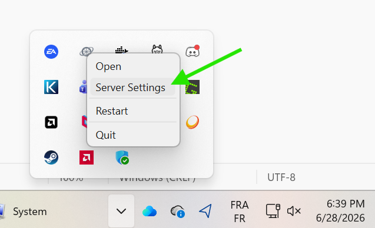

[← Home](Home.md) · **Overview** · [Next: Architecture →](02-Architecture.md)

---

# 1. Overview — MoonlightWeb from the outside

MoonlightWeb turns **any device with a modern browser** (PC, Mac, tablet, phone, TV) into a low-latency game-streaming client for a [Sunshine](https://github.com/LizardByte/Sunshine)-powered PC — with nothing to install on the client side. The server runs on any machine on the same LAN as Sunshine (ideally the Sunshine PC itself) and serves the whole experience as a web app.

Headline capabilities:

- **Low-latency streaming** up to 4K HDR, 120+ FPS, with **H.264 / HEVC / AV1**.
- **WebRTC transport** (DataChannels + RTP media tracks) with automatic WSS fallback — a five-step fallback chain guarantees a connection on almost any network.
- **Opus audio** decoded in the browser with an adaptive jitter buffer.
- **Full input**: keyboard, mouse (pointer-lock), touch trackpad, Xbox/PS **gamepads** with rumble, bidirectional **clipboard**.
- **Auto-discovery** of Sunshine hosts on the LAN (mDNS) + manual IP add.
- **One-click Internet access**: automatic public subdomain + real TLS certificate + UPnP port mapping.
- **Video Enhancement**: GPU upscaling & sharpening (FSR1 / SGSRv1 via WebGPU) in the browser.

## 1.1 The User's journey

### Discover, pair, stream

The home page lists every Sunshine host found on the LAN (mDNS) plus any manually added IP. Each host box carries its own app grid inline — an app is launched directly from its host box.

1. **Discovery** — the server scans the LAN via mDNS (`_nvstream._tcp`); hosts can also be added by IP.
2. **Pairing** — click *Pair*, a PIN dialog appears; type that PIN into Sunshine's web UI (or let the installer auto-pair the local Sunshine). Pairing uses the standard GameStream challenge-response with a generated RSA identity (see [Security](06-Security.md)).
3. **Streaming** — pick an app (or *Desktop*); the browser goes fullscreen into the stream overlay.

### The stream

Desktop and mobile get the same pipeline with adapted input:

| 🖥️ Desktop | 📱 Mobile |
|:---:|:---:|
|  |  |

- **Desktop**: pointer-lock ("gaming mode") or absolute mouse, keyboard capture (Escape is forwarded as a normal key; `Ctrl/Cmd+Alt+Shift+Z` releases the mouse; `Q` quits, `Z` toggles stats, `X` fullscreen, `M` mouse mode).
- **Mobile**: the whole screen is a **relative trackpad** — 1 finger moves the mouse, 2 fingers scroll/pinch, 3 fingers pan; taps click; a toolbar summons the virtual keyboard (input captured by diffing `input` events with a sentinel, the only reliable technique across iOS/Gboard).
- An **overlay header** exposes stats, fullscreen, settings and quit.

### Stream settings

Per-browser preferences (stored in `localStorage`, with server defaults) are edited in the Settings overlay:

| Video settings | Advanced options |
|:---:|:---:|
|  |  |

- **Bitrate** 1–150 Mbps or auto, **resolution** 720p–2160p or *Native Host*, **FPS** 15–240, **codec** auto/H.264/HEVC/AV1 (unsupported options greyed out live via `VideoDecoder.isConfigSupported`), **HDR**, **4:4:4 chroma**, aspect ratio, VSync, performance stats, gaming mode.
- **Video Enhancement** (WebGPU upscaling + sharpening) with algorithm choice (auto / SGSR / FSR1):

## 1.2 The Administrator's journey

The **Admin page** (`https://localhost/admin`, also reachable from the tray icon → *Server Settings*) configures the server itself. It is **only functional from the host machine**: all `/api/admin/*` routes return 403 for non-localhost requests (a *host-key* mechanism extends this to the host's own browser when accessed via the public domain — see [Security](06-Security.md)).

The admin page controls:

- **Access PIN** — generate/clear the 8-character PIN remote devices must enter once; each successful use auto-regenerates it.
- **Sessions table** — every authenticated device with IP, geolocation (city/country), last-seen, streaming flag; sessions can be renamed or revoked (revoking a streaming session kills the stream immediately).
- **Certificate authentication** — download/regenerate a token file that remote users can upload instead of typing a PIN.
- **HTTP/HTTPS ports**, **transport mode** (auto or forced), and the **Internet Access** toggle.
- **Sunshine management** — install/start/stop the local Sunshine when needed.

### Internet access

Enabling **Internet Access** (an explicit, logged opt-in) makes the server automatically:

1. **Detect the public IP** (STUN, HTTPS fallback via ipify/icanhazip).
2. **Register a subdomain** `{uniqueId}.{MW_DOMAIN}` through the PowerDNS REST API (A record + `_owner` TXT ownership token).
3. **Obtain a real TLS certificate** via ACME DNS-01 (ZeroSSL with EAB credentials, else Let's Encrypt), hot-reloaded without restart, auto-renewed under 30 days remaining.
4. **Open router ports** via UPnP (TCP 80/443 + UDP 47999), with strict *external == internal* port parity and deterministic fallback ports when several instances share one NAT.

Known limitations are detected and reported in the UI: UPnP disabled (manual forwarding needed), CGNAT/double-NAT (port forwarding cannot work), port already mapped by another device, restrictive corporate CAs (bring your own domain/cert — see [Settings Reference](07-Settings-Reference.md)).

### First-run setup

- **Windows**: the Inno Setup installer wizard collects the Internet-access consent and Sunshine credentials, then drops a `provisioning.json` the server consumes on first boot (see [Installers](09-Installers-and-Packaging.md)).
- **macOS / Linux**: an in-app **setup wizard** (`/setup`) opens automatically on first launch and performs the same steps via `/api/setup/{status,apply}`.

### Day-2 operations

- A **tray icon** exposes the app/admin URLs (public domain with host key once Internet Access is live).
- A **desktop shortcut** self-heals on every startup to point at the right URL/port.
- Launching the app twice never spawns a duplicate: the second launch asks the running instance to surface the admin page (single-instance lock + `/api/local/focus` + a `/ws/control` channel that redirects an already-open tab).
- An **update banner** on the hosts page polls `/api/update/check` (GitHub Releases) and links the right installer for the platform.
- Logs live in the per-user data dir (`…/MoonlightWeb/MoonlightWeb/logs/moonlightweb.log`); on Windows a crash writes a **minidump** next to them.

## 1.3 What runs where

| Piece | Runs on | Distribution |
|---|---|---|
| **MoonlightWeb server** | Any machine on Sunshine's LAN (ideally the Sunshine PC) | Native installers per platform |
| **Web app** | The client browser | Served by the MoonlightWeb server itself |
| **Sunshine** | The gaming PC | Third-party; installable through MoonlightWeb's wizard |
| **DNS stack** (PowerDNS + dnsdist + Caddy) | A small Linux VM with a public IP | `deploy/powerdns/` Docker stack — maintained by the author for the shared domain, or self-hosted (see [PowerDNS Stack](10-PowerDNS-Stack.md)) |

---

[← Home](Home.md) · [Next: Architecture →](02-Architecture.md)
